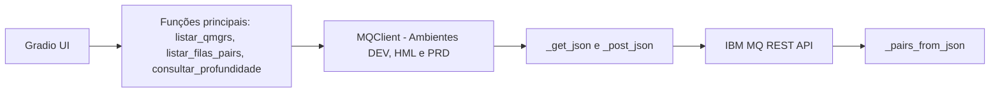
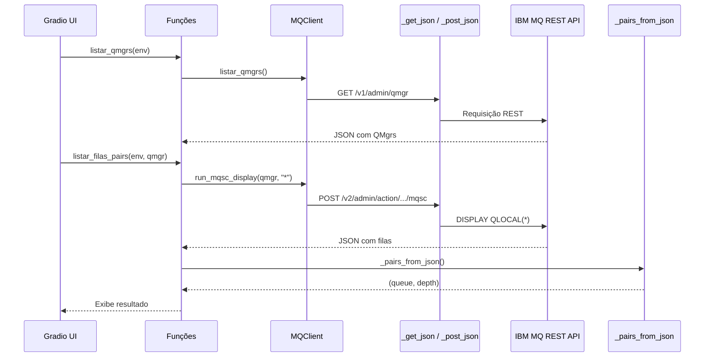

# Portal IBM MQ — Interface REST + UI Gradio

Interface em Python para consultar IBM MQ via API REST (`runCommandJSON`), permitindo listar Queue Managers, visualizar filas QLocal e verificar a profundidade (CURDEPTH) de cada fila — agora com suporte a múltiplos ambientes (DEV/HML/PRD).

---

## Sumário
- [Descrição geral](#descrição-geral)
- [Arquitetura antiga](#arquitetura-antiga)
- [Nova arquitetura (multiambiente)](#nova-arquitetura-multiambiente)
- [Configuração](#configuração)
- [Funções principais](#funções-principais)
- [Interface Gradio](#interface-gradio)
- [Fluxo de execução](#fluxo-de-execução)
- [Requisitos](#requisitos)
- [Licença](#licença)

---

## Descrição geral

O projeto fornece:
- Camada REST simplificada para o IBM MQ;
- Parser que entende múltiplos formatos JSON retornados;
- Interface Gradio para visualização interativa;
- Suporte a múltiplos endpoints (DEV, HML, PRD) via `MQClient`.

Ideal para usuários, administradores e desenvolvedores que precisam monitorar filas QLocal e consultar CURDEPTH de forma rápida e segura.

---

## Arquitetura (multiambiente)

A arquitetura introduz a classe `MQClient`, responsável por isolar a autenticação, sessão e URL base de cada ambiente.  
A UI agora permite selecionar entre DEV / HML / PRD diretamente no painel Gradio.

### Estrutura atualizada



### Sequência



| Melhorias | Descrição |
|------------|------------|
| Isolamento por ambiente | Cada `MQClient` usa sua própria URL e credenciais. |
| Mais seguro | Sem variáveis globais de sessão. |
| Escalável | Fácil adicionar novos endpoints. |
| Filtro automático | Ignora filas internas (`AMQ*`, `SYSTEM.*`). |
| UI aprimorada | Seleção de ambiente + filtro por profundidade. |

---

## Configuração

Cada ambiente é configurado via variáveis de ambiente:

| Variável | Descrição | Exemplo |
|-----------|------------|----------|
| `DEV_URL` / `HML_URL` / `PRD_URL` | URL base da API REST | `https://mq-dev.local:9443` |
| `DEV_USER` / `HML_USER` / `PRD_USER` | Usuário de autenticação | `mqadmin` |
| `DEV_PASS` / `HML_PASS` / `PRD_PASS` | Senha | `mqadmin` |
| `DEV_VERIFY_SSL` | Verifica SSL | `false` |

---

## Funções principais

- `listar_qmgrs(env)` — lista Queue Managers do ambiente selecionado.  
- `listar_filas_pairs(env, qmgr)` — retorna `(queue_name, CURDEPTH)` filtrando filas internas.  
- `consultar_profundidade(env, qmgr, fila)` — consulta individual de fila.  
- `_pairs_from_json(data)` — parser inteligente com dedup e filtro.  

---

## Interface (Gradio)

Componentes principais:
1. Ambiente – Dropdown (DEV/HML/PRD)
2. Queue Managers – Botão Carregar QMgrs
3. Filas (QLocal) – Botão Listar filas + filtro de texto
4. Profundidade – Consulta individual
5. Rodapé – Mostra URL_BASE e SSL

---

## Fluxo de execução

```text
[Usuário]
   ↓
Seleciona ambiente (DEV/HML/PRD)
   ↓
listar_qmgrs(env) → MQClient.listar_qmgrs()
   ↓
listar_filas_pairs(env, qmgr) → MQClient.run_mqsc_display()
   ↓
_pairs_from_json() → Ignora AMQ*/SYSTEM.*
   ↓
Gradio UI → Exibe filas filtradas e profundidades
```

---

## Requisitos

- Python ≥ 3.9  
- Dependências:
  ```bash
  pip install requests gradio urllib3
  ```

---

## Notas de segurança
- Use VERIFY_SSL=true em produção.  
- Nunca versione credenciais.  
- Para certificados corporativos, use MQ_CA_BUNDLE.

---

## Licença
Distribuído sob licença MIT.
